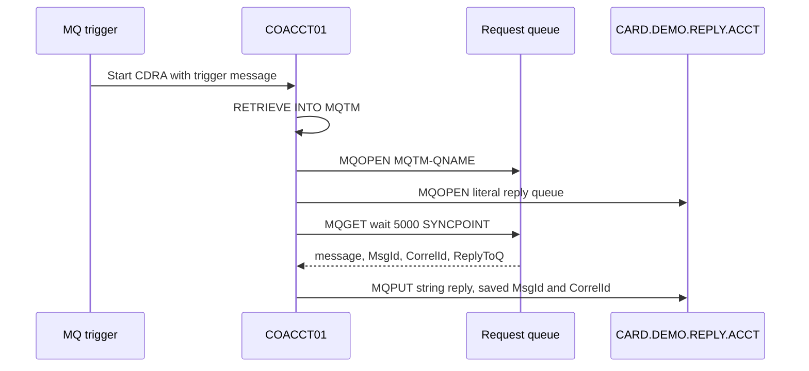

# COACCT01 account reply

Evidence: `app/app-vsam-mq/cbl/COACCT01.cbl:191-214`, `app/app-vsam-mq/cbl/COACCT01.cbl:337-366`, `app/app-vsam-mq/cbl/COACCT01.cbl:469-479`.

```mermaid
sequenceDiagram
    participant Trigger as MQ trigger
    participant CICS as COACCT01
    participant InQ as Request queue
    participant Reply as CARD.DEMO.REPLY.ACCT
    Trigger->>CICS: Start CDRA with trigger message
    CICS->>CICS: RETRIEVE INTO MQTM
    CICS->>InQ: MQOPEN MQTM-QNAME
    CICS->>Reply: MQOPEN literal reply queue
    CICS->>InQ: MQGET wait 5000 SYNCPOINT
    InQ-->>CICS: message, MsgId, CorrelId, ReplyToQ
    CICS->>Reply: MQPUT string reply, saved MsgId and CorrelId
```
